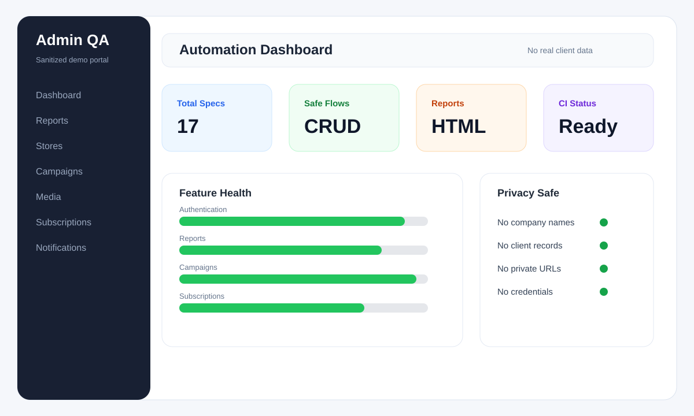
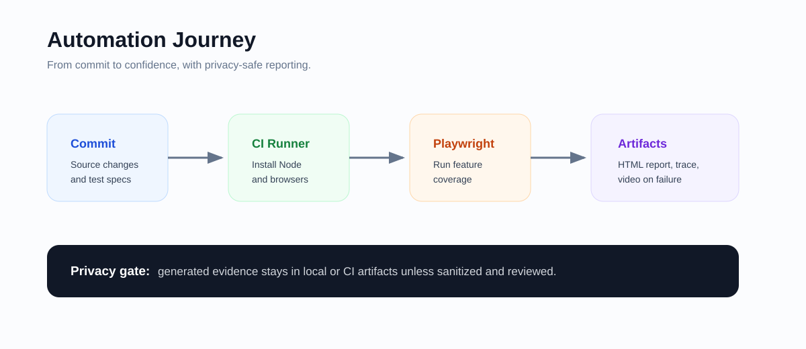
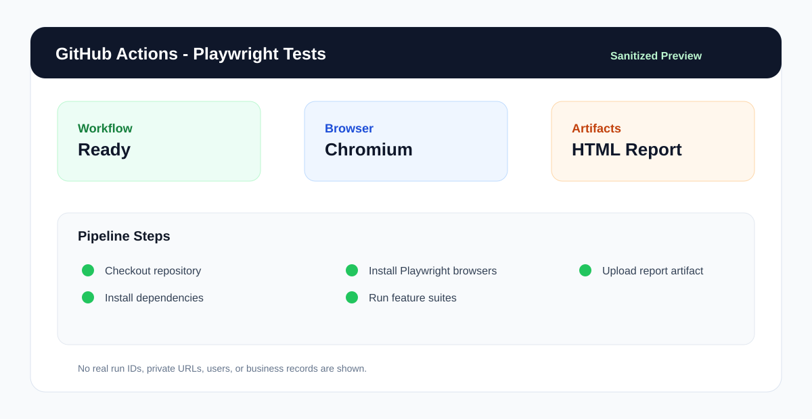

# Admin Portal Playwright Automation

> End-to-end Playwright automation for a full admin portal: authentication, dashboards, reports, operations, campaigns, media, subscriptions, notifications, and CI/CD reporting.

This project is an executable QA system for a real admin-style web UI. The tests follow the same paths an operations user would take: sign in, inspect dashboards, filter records, open dialogs, validate tables, exercise safe create/update/delete paths, and confirm report artifacts.

The documentation is written to be public-repository friendly. Real UI screenshots may be used only after sensitive content is redacted. Do not commit company names, client names, user records, phone numbers, emails, order IDs, private URLs, credentials, budgets, revenue values, or any other business-sensitive data.

## Test Case Document

Full manual testcase documentation:

[Open testcase document](https://docs.google.com/document/d/1Ygw7hUGV8gru99CCkvyM2YsT4JEum7l8b5V8GpcdkAQ/edit?tab=t.0#heading=h.v8182vllkw9o)

Use the Google Doc as the manual testcase catalogue and this repository as the automated execution layer.

## System Preview

<p align="center">
  
</p>

The portal is organized into feature modules. Each module has its own Playwright spec folder, and shared helpers handle login, routing, dialogs, table actions, filters, empty states, and safe cleanup behavior.

## Page-By-Page System Walkthrough

### 01. Authentication

Validates the first security checkpoint of the portal. The tests cover required email and password validation, invalid login handling, successful sign-in, session routing, and common login-page controls.

Command:

```bash
npm run test:auth
```

### 02. Dashboard

Checks the main landing page after login. Coverage includes summary cards, dashboard widgets, quick navigation, visible panels, date or filter controls, sidebar links, and stable page load behavior.

Command:

```bash
npm run test:dashboard
```

### 03. Vendor Performance

Validates operational performance reporting. The test suite checks headers, filters, data tables, empty states, row visibility, pagination, and export-style actions where available.

Command:

```bash
npm run test:vendor
```

### 04. Reports

Covers report modules used by operations and management teams. Tests inspect tab navigation, date filters, store filters, search actions, result tables, downloads, and graceful handling when report data is unavailable.

Command:

```bash
npm run test:reports
```

### 05. Analysis

Verifies analytics pages and chart-heavy views. The suite focuses on page stability, chart containers, filters, comparison controls, and visible summary data.

Command:

```bash
npm run test:analysis
```

### 06. Stores

Checks store-management screens. Coverage includes search, filters, table columns, row actions, status indicators, pagination, and store detail navigation where the environment allows it.

Command:

```bash
npm run test:stores
```

### 07. Store Ratings

Validates rating and feedback views. Tests cover rating filters, store filters, date filters, result tables, export availability, first-row actions, and clear/reset behavior.

Command:

```bash
npm run test:ratings
```

### 08. Offers

Exercises offer-management workflows. Coverage includes create dialogs, form validation, search, edit, delete, pagination, export visibility, and safe handling for incomplete or restricted flows.

Command:

```bash
npm run test:offers
```

### 09. Order Management

Checks order list and order-inspection flows. Tests validate status filters, secondary filters, date-range search, text search, clear actions, export controls, pagination, and view-order paths.

Command:

```bash
npm run test:orders
```

### 10. Portfolio Analysis

Validates portfolio-style reporting screens. Coverage includes page shell, search behavior, result tables, pagination, first-row actions, and download availability where supported.

Command:

```bash
npm run test:portfolio
```

### 11. Accounts Management

Checks account-management workflows. Tests cover account search, filters, tables, edit/action paths, assignment flows, bulk-upload surfaces, and account-manager download actions.

Command:

```bash
npm run test:accounts
```

### 12. Campaigns

One of the broadest modules in the suite. Tests cover campaign creation, management, edit/delete behavior, promo code configuration, campaign offers, free delivery, store pinning, fixed delivery fee management, filters, search, and pagination.

Command:

```bash
npm run test:campaigns
```

### 13. Smart Boost Campaign

Validates boosted campaign workflows. Coverage includes the list page, search, filters, empty states, create form, export visibility, row actions, manage campaign navigation, dashboard navigation, top-up dialogs, and terminate dialogs.

Command:

```bash
npm run test:boost
```

### 14. Driver KPI Slabs

Checks driver KPI slab configuration pages. Tests validate slab scheme pages such as attendance, fines, block count, redispatch rate, and delivery speed, including create/edit/delete surfaces where available.

Command:

```bash
npm run test:kpi
```

### 15. Reels

Validates media-style content management. The suite checks list loading, row actions, view/edit/delete flows, create-form behavior, required media handling, search, filters, and pagination.

Command:

```bash
npm run test:reels
```

### 16. TM Done Club

Covers membership/subscription-style modules. Tests validate analytics, subscription plans, subscription reports, cancellation reasons, table visibility, filters, create/update surfaces, and safe skip behavior when backend data is not returned.

Command:

```bash
npm run test:club
```

### 17. User Notifications

Checks notification-management workflows. Coverage includes page shell, filters, tables, create or action dialogs, and stable navigation through notification-related controls.

Command:

```bash
npm run test:user-notifications
```

## Automation Flow

<p align="center">
  
</p>

1. Developer pushes code or opens a pull request.
2. GitHub Actions installs dependencies and browsers.
3. Playwright signs in using repository secrets.
4. Specs run sequentially for shared-environment stability.
5. HTML reports, traces, videos, and screenshots are saved as artifacts.

## CI/CD Report Preview

<p align="center">
  
</p>

Workflow file:

```text
.github/workflows/playwright.yml
```

The workflow runs on pushes and pull requests to `main` or `master`.

## Project Structure

```text
tests/
  01-Auth/
  02-Dashboard/
  03-VendorPerformance/
  04-Reports/
  05-Analysis/
  06-Stores/
  07-Stores Ratings/
  08-Offers/
  09-Order Management/
  10-Portfolio Analysis/
  11-Accounts Management/
  12-Campaigns/
  13-Smart Boost Campaign/
  14-Driver KPI Slabs/
  15-Reels/
  16-TM Done Club/
  17-User Notifications/
  helpers/
docs/
  screenshots/
playwright.config.js
package.json
```

## Tech Stack

- Playwright Test
- JavaScript ES modules
- Node.js
- GitHub Actions

## Quick Start

Install dependencies:

```bash
npm ci
npx playwright install
```

Run the full suite:

```bash
npm test
```

Open the latest HTML report:

```bash
npm run report
```

## Useful Commands

```bash
npm run test:auth
npm run test:dashboard
npm run test:reports
npm run test:campaigns
npm run test:boost
npm run test:reels
npm run test:club
npm run test:user-notifications
```

Debug locally:

```bash
npm run test:headed
npm run test:debug
```

## Environment Setup

The shared login helper reads:

```text
TMDONE_BASE_URL
TMDONE_EMAIL
TMDONE_PASSWORD
```

For GitHub Actions, configure:

- `TMDONE_EMAIL`: repository secret
- `TMDONE_PASSWORD`: repository secret
- `TMDONE_BASE_URL`: repository variable, optional

Do not commit credentials, tokens, private URLs, cookies, account data, or environment-specific secrets.

## Screenshot Rules

Real UI screenshots are useful, but they must be cleaned before commit.

Allowed:

- Real UI layout with sensitive data blurred or replaced
- Mock names such as `User A`, `Store 01`, `Campaign 01`
- Generic amounts such as `100.00`, `250.00`, `1,000.00`
- Redacted URLs and IDs
- Recreated demo screens

Not allowed:

- Real company names
- Client names
- Customer names, emails, phone numbers, addresses
- Real order IDs, account IDs, campaign IDs, subscription IDs
- Real revenue, budget, performance, or private business values
- Tokens, cookies, passwords, API keys, internal URLs

Recommended screenshot workflow:

1. Capture the real UI locally.
2. Blur or replace all sensitive values.
3. Save the cleaned image under `docs/screenshots/`.
4. Review the image manually before committing.

## Reports And Artifacts

Local Playwright outputs:

```text
test-results/
playwright-report/
blob-report/
```

These folders are ignored by Git. CI artifacts are available from the GitHub Actions run page.

## Engineering Notes

- Specs are grouped by feature area for easier triage.
- Shared helpers centralize login, route navigation, dialogs, and safe actions.
- Tests use stable selectors and explicit empty-state handling for UAT variability.
- Destructive paths are guarded where possible to protect shared test environments.

## Before Pushing

Recommended smoke checks:

```bash
git status --short
npm run test:boost
npm run test:reels
npx playwright test SubscriptionPlans.spec.js
```

For full confidence:

```bash
npm test
```
